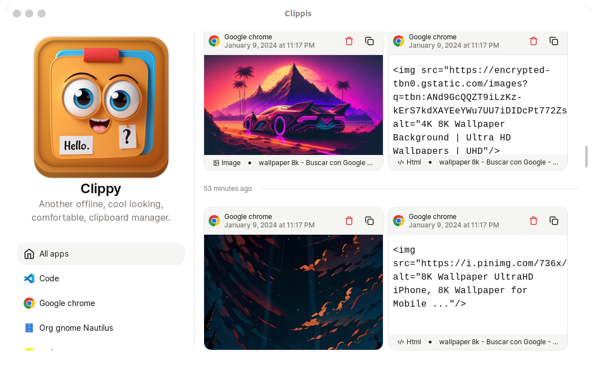
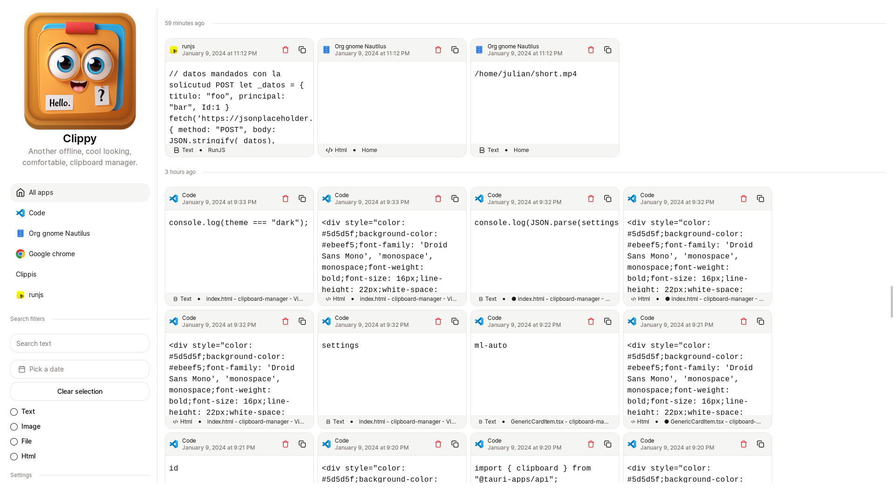

<h1 align="center">Clippis</h1>
<p align="center">Another offline, cool looking, comfortable, clipboard manager. Built with Tauri for Linux(gnome)</p>

## Screenshots

Captured in Ubuntu 22.04 x11. The app is not optimized for wayland yet.



## Features

- [x] No internet connection required. - [x] No data is sent to any server.
- [x] All data is stored locally (scroll down to end of sidebar to see where database is located).
- [x] Filter by
  - [x] Text
  - [x] Type of clipboard item
  - [x] Date
  - [x] App where the item was copied
- [x] Search by text
- [x] Supports html, text and images (files, uris and urls soon)
- [x] Delete items from history
- [x] Copy items from history
- [x] Clipboard history items groupped by relative date
- [x] Dark mode
- [x] Some settings

## Future features

- [ ] Autocompress images
- [ ] Support for files, uris and urls
- [ ] Sync across devices in the same network
- [ ] Blacklist apps
- [ ] Whitelist apps
- [ ] Drag and drop items from history
- [ ] Generate previews for urls, files and uris
- [ ] UI customization
- [ ] Virtualization for history item list
- [ ] Performance improvements (saving images to disk, loading images from disk, loading history items from database, optimizing image processing, etc)
- [ ] Support for other linux desktop environments
- [ ] Support for Windows
- [ ] Support for MacOS

## Installation

1. Install dependencies

```bash
sudo apt install xclip
```

2. Download the latest release from [here](https://github.com/JulianKominovic/clipboard-manager/releases/latest)
3. Download the .deb file
4. Install it with `sudo apt install <package-downloaded>`
5. Replace `<package-downloaded>` with the path of the package downloaded in step 2
6. `Clippis` should be installed now. You can open it from the applications menu or by running `clippis` in the terminal

## Goal

- [x] Create a simple clipboard manager for linux
- [x] Save clipboard history to database (`~/.clipboard_history/db`)

## Dev dependencies

```bash
# sudo apt install xclip
sudo apt-get install xorg-dev libxcb-shape0-dev libxcb-xfixes0-dev
```

## Libraries used

- `arboard` - for clipboard management
- `chrono` - for date and time
- `clipboard_master` - clipboard event listener
- `homedir` - for getting home directory
- `once_cell` - for lazy static initialization
- `serde` - for serialization and deserialization
- `sled` - for database
- `bincode` - for binary serialization and deserialization

## Changes

- [x] Clipboard listener working alone
- [x] Clipboard data saved to Sled database
- [x] Clipboard history tracking integrated with Tauri
- [x] Images are saved to app data directory
- [x] Images are loaded from disk and displayed in the UI as `Recent images`. A huge performance improvement
- [x] Database footprint reduced by using `bincode` for serialization and deserialization and keeping files in disk instead of in database file
- [x] Clipboard works with images. Now you can re-copy images from the clipboard history.
